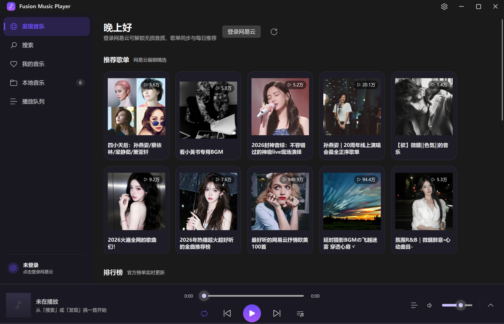
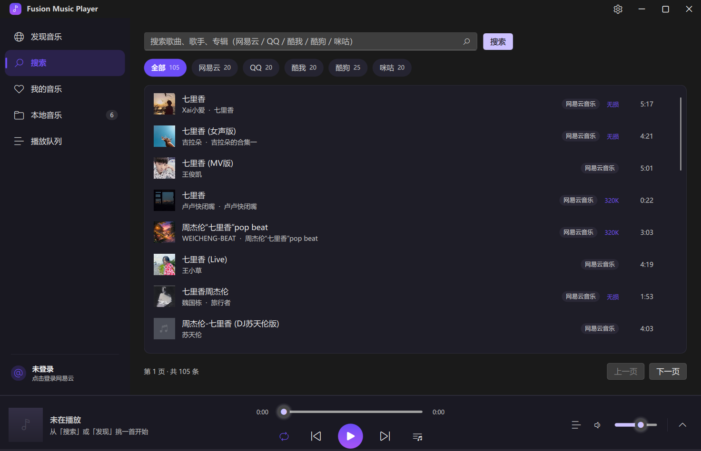
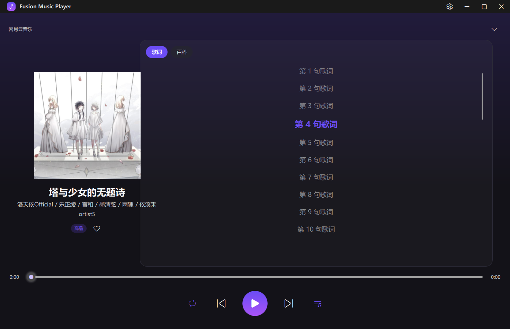
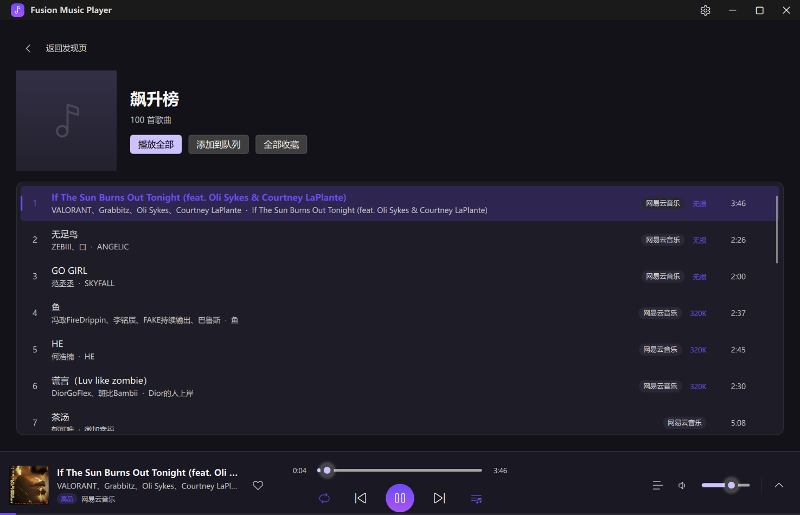
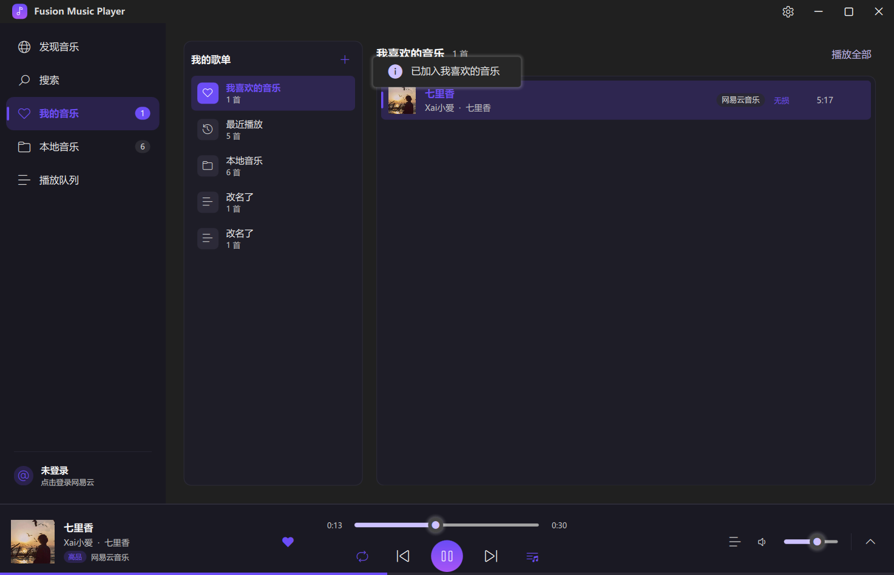
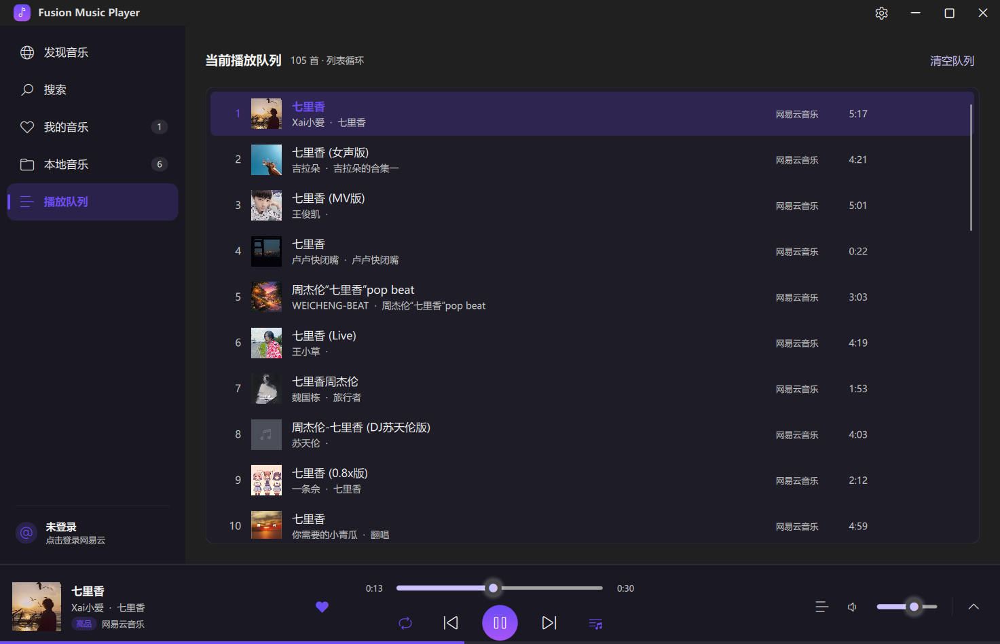
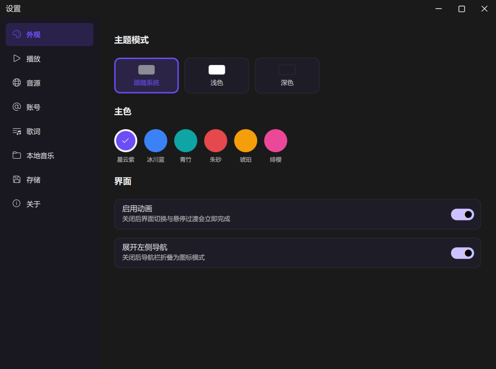
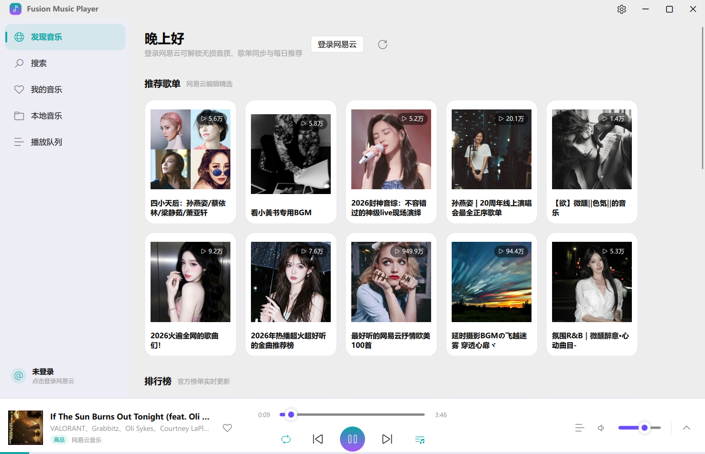
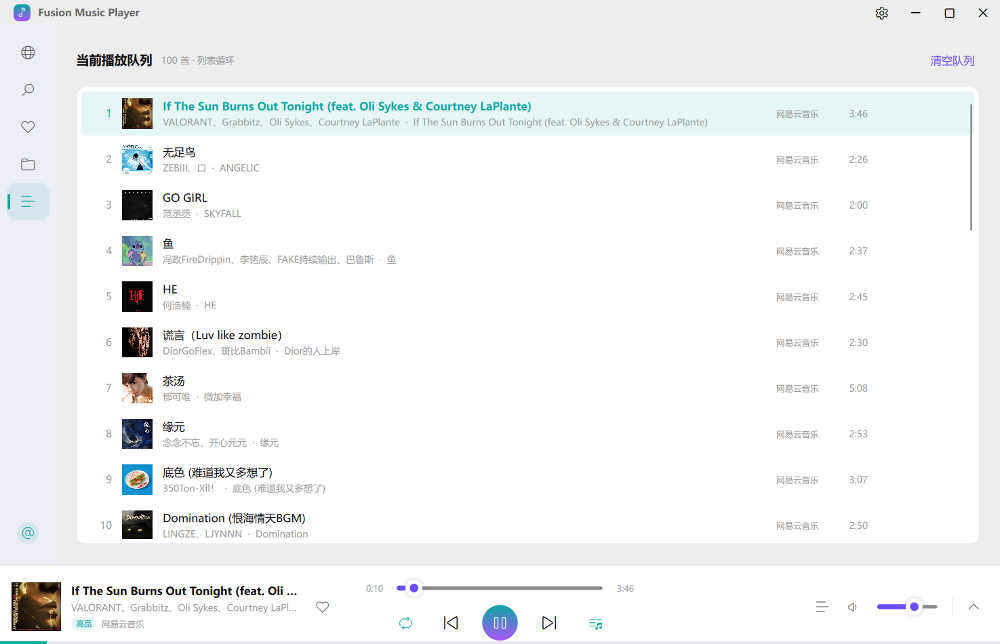

# Fusion Music Player

从 [FMCL](https://github.com/Janson20/FMCL) 中把音乐播放器完整拆出来，
用 **PySide6 + FluentUI QML** 重新实现的独立桌面音乐播放器。

网易云登录凭据以 **AES-256-GCM 认证加密**保存在**程序所在目录**下，
整个应用是绿色便携的：拷贝目录即可带走全部数据。

---

## 界面

完全对照设计草图：标题栏（品牌 + 设置按钮 + 系统按钮）、左侧标签页导航、
主界面、底部播放栏（封面 / 传输控件 / 展开箭头），底部栏可向上展开为
「大封面 + 滚动歌词」的播放页。

| 发现音乐 | 搜索 |
|---|---|
|  |  |

| 展开播放页（歌词） | 歌单详情 |
|---|---|
|  |  |

| 我的音乐 | 播放队列 |
|---|---|
|  |  |

| 设置 | 网易云登录 |
|---|---|
|  |  |

| 浅色主题 | 折叠导航 |
|---|---|
|  |  |

```
┌──────────────────────────────────────────────────────────────┐
│ ◈ Fusion Music Player                       ⚙   −   □   ✕    │  标题栏
├────────────┬─────────────────────────────────────────────────┤
│  标签页     │                  主界面                          │
│  发现音乐   │      （发现 / 搜索 / 我的音乐 / 本地 / 队列）      │
│  搜索       │                                                 │
│  我的音乐   │                                                 │
│  本地音乐   │                                                 │
│  播放队列   │                                                 │
├────────────┴─────────────────────────────────────────────────┤
│ (封面) 曲名/歌手  ⏮  ▶  ⏭   ─────●─────  🔊 ────  ≡    ⌃     │  播放栏
└──────────────────────────────────────────────────────────────┘
```

支持浅色 / 深色 / 跟随系统三种主题与 6 套预设主色（可自定义），
导航栏可折叠为图标模式。

---

## 快速开始

```bash
pip install -r requirements.txt
python main.py
```

数据默认落在 `./data/`；也可以用参数或环境变量指定：

```bash
python main.py --data-dir D:\Music\FusionData
set FUSION_MUSIC_HOME=D:\Music\FusionData && python main.py
```

### 可选依赖

* `pypinyin` —— 中文歌单按拼音排序（缺失时退化为字符序）
* `qrcode` + `pillow` —— **扫码登录必需**，缺失时只能用手机号或 Cookie 登录

---

## 功能

### 音源
* 网易云音乐、QQ音乐、酷我、酷狗、咪咕并发搜索，结果按音源分页展示
* **跨源兜底**：当前音源无版权 / VIP 限制时，自动在其它平台按
  「歌名 + 歌手」搜索、**以 15 秒时长容差排除翻唱与伴奏**，找到可用版本继续播放
* 音质自动降级链：同源档位回退 → 跨源重试（高音质优先）
* B 站音源默认仅参与兜底（其构造需要联网抓取 buvid，已改为惰性加载）

### 播放
* `QMediaPlayer` 流式播放，**不需要像 FMCL 那样先整首下载**
  （仅当音源要求自定义请求头时才下载到缓存再播）
* 4 种播放模式：顺序 / 列表循环 / 单曲循环 / 随机（真洗牌，不重复）
* 单一队列模型（FMCL 是「文件夹列表 + 歌单上下文」双轨，自然播完时会串烧到文件夹的下一首）
* 淡入淡出、静音记忆、上一首回溯真实播放历史
* 播放失败自动跳过，跨源兜底时在界面提示已切换的音源
* 下载内容的**文件头 + 时长**双重校验，避免把 HTML 错误页或 VIP 试听片段当成完整歌曲

### 网易云账号
* **扫码登录**（本地渲染二维码，与 FMCL 一致，不请求任何二维码图片接口）
* 手机号 + 短信验证码登录
* 手机号 + 密码登录（网易已逐步下线该方式，服务端返回 `502` 时会给出明确提示）
* 手动粘贴 Cookie 登录
* 登录后解锁无损 / Hi-Res、翻译歌词与罗马音、账号歌单
* 凭据加密保存在程序目录，启动自动恢复；**临近过期自动续期**
  （默认剩余不足 7 天时向 `/api/login/token/refresh` 换发新凭据，可在设置里关掉），
  设置页能看到有效期、也能手动续期
* 服务端明确回报凭据失效时，界面直接置为未登录并提示重新登录
  （网络不通**不会**清登录态，两种情形分得很开）

### 音乐库
* 自建歌单（新建 / 重命名 / 删除 / 清空 / 排序 / 手动调序）
* 「我喜欢的音乐」（FMCL 完全没有本地收藏）与「最近播放」历史
* 本地音乐扫描（`mutagen` 读取标签与时长），支持同目录 `.lrc` 字幕
* 全部落盘在程序目录，原子写入，解析失败时备份为 `*.corrupt` 而不是丢弃

### 歌手
* **任何地方的歌手名都能点**：曲目行、播放栏、展开播放页，右键菜单里还能
  在多位歌手里挑一位（「查看歌手 → 洛天依」）
* 歌手页：圆形头像、别名、单曲 / 专辑 / MV / 粉丝数、简介，加热门歌曲列表
  （最多 50 首，可「播放全部 / 添加到队列 / 全部收藏」）
* 搜索的「全部」标签页置顶一张歌手卡片和一张歌单卡片（对应网易云的「综合」），
  点了直达歌手页 / 歌单页
* 其它音源（QQ / 酷我 / 酷狗 / 咪咕 / 本地文件）没有网易云的歌手 id，
  所以统一**按名字定位**：先搜同名歌手，再用详情接口取热门歌曲，结果在一个
  会话内缓存
* 专辑 / MV / 相似歌手 / 关注 这些标签页**没做** —— 都需要各自的详情页来承接

### 歌词
* LRC 解析沿用 FMCL 的正则与时间规则
* **翻译与罗马音真正接上**（FMCL 请求了却只读主歌词，翻译永远是空的）
* 当前行自动滚到中央、高亮、逐行平滑过渡
* 歌词文字**默认居中**，可在「设置 → 歌词 → 对齐方式」改成靠左 / 靠右

### 设置
外观 / 播放 / 音源 / 账号 / 歌词 / 本地音乐 / 存储 / 关于，共 8 个分区。

---

## 开发与测试

```bash
python main.py                       # 运行
python tests/test_core.py            # 核心逻辑回归（离线，25 项）
python tests/test_ui_smoke.py        # QML 界面冒烟（需要显示环境）
python tools/check_qml_signals.py    # QML 信号处理器静态检查
python tools/account_probe.py        # 排查网易云账号识别问题（不打印 Cookie）
```

`tests/test_core.py` 覆盖凭据加密仓库（往返、篡改检测、缺文件）、
LRC 解析（补零、offset、一行多标签、翻译配对、当前行二分与缓存）、
播放队列（四种播放模式、洗牌不重复、历史回溯、增删移动、序列化）
与曲目模型，**不依赖 Qt 界面也不联网**，可直接交给 pytest。

- **测试**：`tests/test_core.py`（凭据加密、LRC 解析、播放队列，24 项，离线可跑）

`tests/test_ui_smoke.py` 会启动真实界面并校验窗口、导航与覆盖层行为，守住这些
曾经真实出现过的缺陷：设置 / 登录窗口跟着主窗口一起弹出来；关闭后无法再打开
（`Cannot call method 'showWindow' of null`）；歌单详情页左上角「返回」点了没反应
（信号发了但没人接）；展开播放页与歌单详情覆盖层的空白处会把鼠标事件放过去、
点到底下的导航栏；隐藏歌词后封面区赖在左边不居中；歌词写死靠左；点歌手名进不去
歌手页（或者反过来，被整行的「播放」抢走点击）。**它只在本地跑**，不进 CI：

```bash
python tests/test_ui_smoke.py
# 无显示环境（Linux CI / 服务器）：
xvfb-run -a python tests/test_ui_smoke.py
```

CI 里跑它需要在 ubuntu runner 上装一整套 Qt 的 X / OpenGL / 音频系统库
（`libegl1`、`libva2`、`libpulse0`、gstreamer 等，装一次好几分钟），
为了省 runner 时间就没放进去 —— 本地跑一次只要十几秒。

`tools/check_qml_signals.py` 是纯静态检查（不需要 Qt 运行时），专门拦已废弃的
信号参数注入：

```qml
// ✗ Qt 6.7+ 会报 Parameter "pageId" is not declared
onPageRequested: app.go(pageId)
// ✓
onPageRequested: function (pageId) { app.go(pageId) }
```

它会自动收集项目里所有 `signal foo(Type name)` 的参数名，再找出依赖注入的
处理器。这条检查留在 CI 里，因为它能覆盖全部 QML 文件，而界面冒烟测试只在本地跑。

代码风格：`python -m pyflakes main.py app/*.py app/bridges app/core app/security tests`

> `app/sources/` 下取自 FMCL 的 8 个文件保持与上游逐字一致（仅改相对导入），
> 因此 `pyflakes` 会对其报出上游原有的未使用导入与变量，这是有意保留的，
> CI 也只对本项目自有代码做门禁。

---

## 打包与发布

### 本地打包

```bash
pip install -r requirements-dev.txt
python -m PyInstaller build.spec --noconfirm            # 目录模式，启动快
$env:FMP_ONEFILE="1"; python -m PyInstaller build.spec  # 单文件模式
python tools/audit_bundle.py dist/FusionMusicPlayer     # 校验依赖是否齐全
```

产物在 `dist/`。目录模式约 204 MB，单文件模式约 100 MB 出头。

`build.spec` 里有三处容易踩的坑，都写在注释里了：

* `app/sources` 的音源是 `importlib` 动态导入的，必须手写进 `hiddenimports`，
  否则打包后一搜索就报「音源加载失败」；
* 不能用 `collect_submodules("qrcode")` —— 它会连带拉进 numpy / lxml / scipy
  （`qrcode.image.styledpil` 用 numpy），体积凭空多出 80 MB；
* PySide6 的 hook 会把整个 Qt 目录收进来（含 195 MB 的 `Qt6WebEngineCore.dll`），
  必须在 `EXE/COLLECT` 之前过滤 `Analysis.binaries`；但 **`Qt6ShaderTools.dll`
  不能删** —— FluentUI 的 `FluClip` 经由 `Qt5Compat.GraphicalEffects` 依赖它。

`tools/audit_bundle.py` 会遍历产物里每个 DLL/PYD，解析 PE 导入表并报告
「既没打包、也不属于 Windows 系统」的依赖。上面那条 ShaderTools 就是这么
发现的——它只在运行时报「无法加载库」，静态检查完全看不出来。

### 发布流程

版本号的唯一来源是 `app/_version.py`（入库），发布流水线在打包前会依据
git tag 再覆写一次，两者由 `scripts/release.py` 保证同步。

一条命令完成发版（参考 FMCL 的 `scripts/release.py`）：

```bash
python scripts/release.py patch          # 1.0.0 -> 1.0.1
python scripts/release.py minor          # 1.0.0 -> 1.1.0
python scripts/release.py 1.2.3          # 指定版本号
python scripts/release.py patch --dry-run   # 只预览
python scripts/release.py patch --no-push   # 提交并打 tag，但不推送
```

它会依次：校验工作区干净 → 确认分支与标签未被占用 → **跑核心测试**
（不通过就中止）→ 更新 `app/_version.py` → 提交 `chore: release vX.Y.Z`
→ 打**附注标签** → 推送分支与标签。

推送 tag 后 GitHub Actions 自动执行：

```
build-windows → release
```

1. **build-windows**：注入 tag 版本号 → 打包目录版与单文件版 → 20 秒启动自检
   → 打成 ZIP / EXE；
2. **release**：按约定式提交聚合 changelog（✨ 新功能 / 🐛 修复 / 💡 改进 /
   📝 其它），用 `softprops/action-gh-release` 建 Release 并附上下载表格。

**发版流程刻意做得很轻**：不跑测试门禁、不做多平台矩阵。测试在 `ci.yml` 里
（push / PR 时跑，单 job，一分钟内结束），发版时不重复跑一遍，省 runner 时间。

唯一保留的是一个 20 秒的启动自检，而且设成了 `continue-on-error` ——
**只报告、不阻断**。打包出来的程序能不能起来本地不一定复现（很容易漏收一个
Qt 插件 DLL，我就踩过一次），有这条 warning 至少能立刻看到。不想要就把
`Boot check` 那一步删掉。

发布产物：

| 文件 | 说明 |
|---|---|
| `FusionMusicPlayer-<版本>-win-x64.zip` | 便携版，解压即用，启动更快 |
| `FusionMusicPlayer-<版本>-win-x64.exe` | 单文件版，首次启动需解压，稍慢 |

> 也可以手动推 tag（`git tag -a v1.2.3 -m "..." && git push origin v1.2.3`）。
> 这种情况下如果 `app/_version.py` 与 tag 对不上，流水线只会打一条 warning，
> 打包仍按 tag 的版本号走 —— 产物里的版本号永远是对的。

`.github/workflows/ci.yml` 在 push / PR 上只跑一个 job：pyflakes 门禁 +
核心测试（约一分钟）。**不在这里做 PyInstaller 打包** —— 每次提交都完整打一次包
既慢又没必要，打包问题交给发版时的 `build-windows` 去暴露。

macOS / Linux 未提供预编译包，从源码运行即可（`pip install -r requirements.txt && python main.py`）。

---

## 键盘快捷键

| 快捷键 | 功能 |
|---|---|
| `Space` | 播放 / 暂停（输入框聚焦时不触发） |
| `Ctrl + ← / →` | 上一首 / 下一首 |
| `Ctrl + ↑ / ↓` | 音量 ±5 |
| `Ctrl + F` | 跳到搜索页 |
| `Esc` | 收起展开播放页 / 关闭歌单详情 |

---

## 数据目录

默认 `./data/`（程序所在目录），全部内容如下：

```
data/
├── config.json          设置
├── credentials.enc      网易云凭据（AES-256-GCM，认证加密）
├── keys/master.key      主密钥（Windows 下由 DPAPI 按当前用户保护）
├── playlists.json       歌单
├── favorites.json       我喜欢的音乐
├── history.json         播放历史
├── local.json           本地曲库索引
├── cache/               封面 / 歌词 / 音频缓存
└── logs/fusion.log      运行日志（滚动，2MB × 4）
```

### 凭据加密

| 项目 | 实现 |
|---|---|
| 算法 | AES-256-GCM（认证加密，篡改必然解密失败） |
| 文件格式 | 带版本号的 JSON 信封：`format_version` / `cipher` / `kdf` / `salt` / `nonce` / `payload` |
| 主密钥 | `data/keys/master.key`，32 字节随机；**Windows 下由 DPAPI（当前用户）包裹**，拷到别的机器或别的 Windows 用户下无法解开 |
| 密钥派生 | 默认 HKDF-SHA256；设置 `FUSION_MUSIC_MASTER_PASSWORD` 后改为 PBKDF2-HMAC-SHA256（600,000 次迭代 + 随机盐），实现真正的跨机可移植 |
| 落盘 | 临时文件 + `os.replace` 原子替换；加密失败时**拒绝写入**而不是写明文 |
| 密钥文件损坏 | **绝不自动覆盖重建**，而是报错并保留原文件，避免旧凭据永久不可解 |
| 有效期 | 服务端给 `MUSIC_U` 的 Max-Age 约 **180 天**；剩余不足 `account.cookie_refresh_days`（默认 7）天时自动调 `/api/login/token/refresh` 换发新凭据，理论上只要不是长期不开就永远不用重新登录 |
| 失效处理 | 服务端确认失效 → 清内存登录态并提示重新登录（**不删凭据文件**，避免风控误判把凭据弄丢）；网络故障只记日志，不动登录态 |

> **安全边界**：默认模式下密钥文件与密文同处一个可拷贝目录，因此本方案用于防止
> 凭据以明文形式暴露（配置被查看、同步、误发、日志泄漏），**不构成**对能读取该
> 目录的本地攻击者的防护。需要更强保护时请启用主密码模式。

凭据内容形如：

```json
{"provider": "netease", "cookies": "MUSIC_U=...; __csrf=...", "user_id": 123,
 "nickname": "...", "vip_type": 11, "expires_at": 1750000000}
```

日志中**绝不打印 Cookie**。

---

## 项目结构

```
FusionMusicPlayer/
├── main.py                      入口（含依赖自检）
├── requirements.txt
├── app/
│   ├── application.py           QGuiApplication + QML 引擎装配
│   ├── paths.py                 程序 / 数据目录解析
│   ├── config.py                设置持久化（浅合并 + 点号路径）
│   ├── security/vault.py        凭据加密仓库
│   ├── sources/                 音源层
│   │   ├── __init__.py          惰性注册表 + 跨源兜底 + 网易云账号门面
│   │   ├── base.py utils.py wy.py …   取自 FMCL（见 NOTICE.md）
│   │   └── netease.py           发现页补充接口（eapi 通道）+ 翻译歌词
│   ├── core/
│   │   ├── models.py            Track 模型 + QML 列表模型
│   │   ├── queue.py             单一队列与播放模式
│   │   ├── player.py            QMediaPlayer 播放引擎
│   │   ├── resolver.py          地址解析 / 校验 / 跨源兜底
│   │   ├── lyrics.py            LRC 解析（含翻译 / 罗马音配对）
│   │   ├── store.py             歌单 / 收藏 / 历史 / 本地曲库
│   │   ├── cache.py             封面 / 歌词 / 音频缓存与 LRU 清理
│   │   └── account.py           网易云登录与凭据持久化
│   ├── bridges/                 QML ↔ Python 控制器
│   │   ├── app.py               导航 / 通知 / 窗口状态
│   │   ├── search.py            多音源搜索（含搜索置顶的歌手 / 歌单卡片）
│   │   ├── library.py           歌单 / 收藏 / 本地扫描
│   │   ├── discover.py          推荐 / 排行榜 / 歌单详情
│   │   ├── artist.py            歌手页（按 id 或名字打开）
│   │   └── settings.py          设置与缓存管理
│   └── ui/                      QML 界面
│       ├── Main.qml qmldir Theme.qml ArtistNames.js
│       ├── components/          标题栏 / 导航 / 播放栏 / 曲目行 / 对话框…
│       ├── pages/               发现 / 搜索 / 我的音乐 / 本地 / 队列
│       ├── panels/              展开播放页 / 歌单详情 / 歌手详情
│       └── windows/             设置 / 登录
└── assets/icon.ico icon.png
```

---

## 相对 FMCL 的关键改动

FMCL 的音乐模块是 `customtkinter` + `pygame.mixer`，UI 约 4300 行不可复用，
且音频后端要求「先整首下载才能播」。本次重构在保持行为语义的前提下做了这些替换：

| 方面 | FMCL | 本项目 |
|---|---|---|
| UI | customtkinter | QML + FluentUI（支持深浅色、主题色、动画） |
| 音频后端 | `pygame.mixer`（必须先整首下载） | `QMediaPlayer` 流式播放 |
| 进度更新 | `after(500)` 轮询 `get_busy()` | Qt 原生信号 |
| seek | stop + load + play（每次重载文件） | `setPosition()` |
| 队列 | 文件夹列表 + 歌单上下文双轨 | 单一队列 |
| 随机播放 | 重掷骰子，会重复播放 | 洗牌序列 |
| 「上一首」 | 单纯下标 -1 | 真实播放历史回溯 |
| 本地收藏 | 无 | 「我喜欢的音乐」 |
| 本地歌词 | 不支持 | 同目录 `.lrc` + 内嵌标签 |
| 歌词翻译 | 请求了却从不解析 | 真正显示 |
| 音效 | 离线整文件 DSP，调参需切歌 | 未实现（见下） |
| 凭据存储 | 与配置同文件的 Fernet，密钥同目录，损坏时会静默重建覆盖 | 独立加密文件 + 版本化信封 + DPAPI + 拒绝覆盖 |
| 桌面歌词 / 全局热键 / 系统媒体控制 | 有 | 暂未实现（见下） |

### 尚未移植

* **音效（EQ / 混响 / 变调 / 变速）** —— FMCL 用 `pydub + numpy + scipy` 做整文件离线处理，
  调参必须切歌才生效、seek 后还会丢失。QML 侧要做对需要实时 DSP
  （`QAudioSink` + 自定义 `QIODevice`，或换 libmpv 后端），属于独立工作量，本次未做。
* **桌面歌词浮窗**、**全局热键**、**Windows 系统媒体控制中心（SMTC）**
* **歌词逐字（karaoke）渲染** —— 解析器已支持 `<mm:ss,ms>` 逐字标签与
  `is_word_based`/`words` 字段，界面暂按整行渲染。

---

## 已知限制

* 网易云**密码登录**已被服务端限制（返回 `502 请切换登录方式或升级版本`），
  请优先使用扫码或短信验证码。
* 未登录时最高音质为 128K；无损 / Hi-Res 需要对应会员。
* 热搜接口在部分环境不可用，此时发现页会自动省略该区块。
* `weapi` 域名在本机环境常被风控拦截返回空响应，因此所有补充接口都走 eapi 通道
  （与 FMCL 注释中的观察一致）。
* 播放版权内容依赖第三方平台的公开接口，稳定性不受本项目控制。

---

## 许可

GPL-3.0-only。音源实现来自 FMCL，详见 [`NOTICE.md`](NOTICE.md)。
