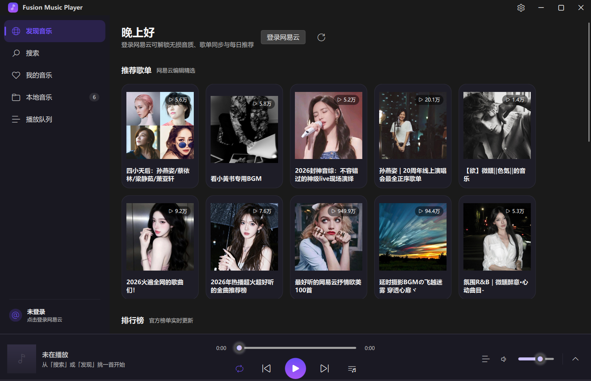
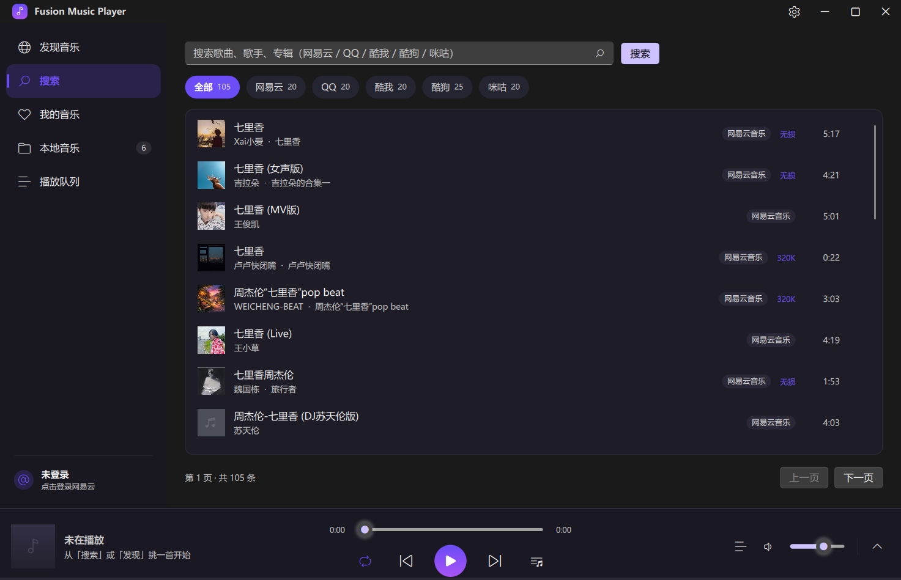
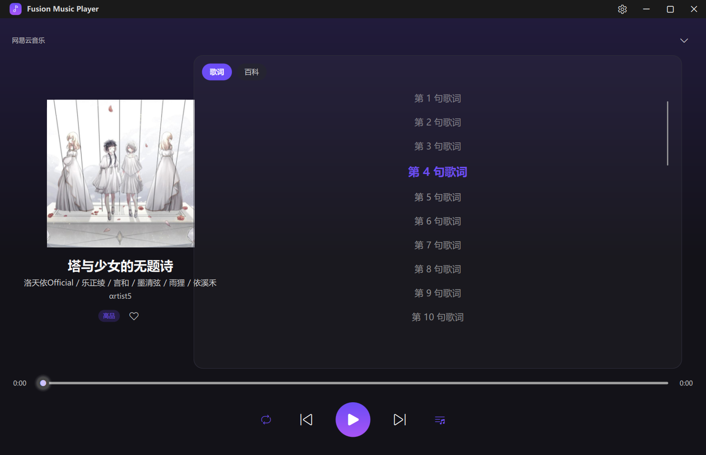
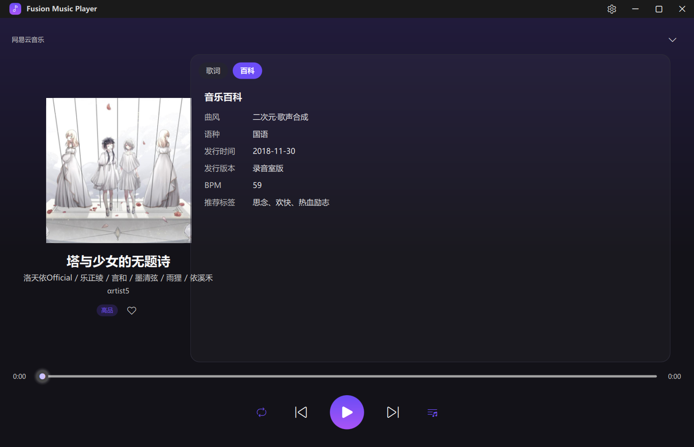
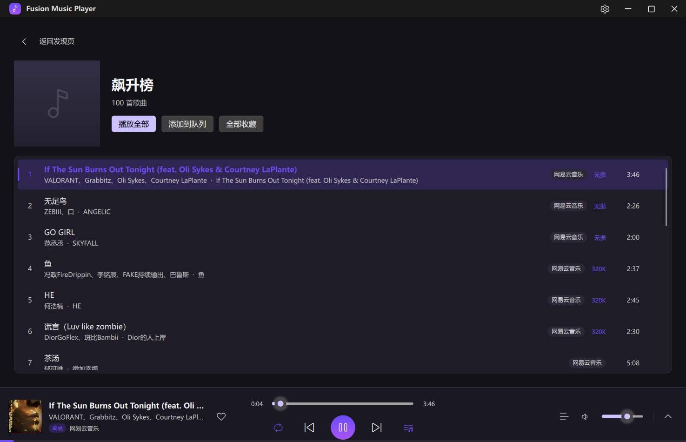
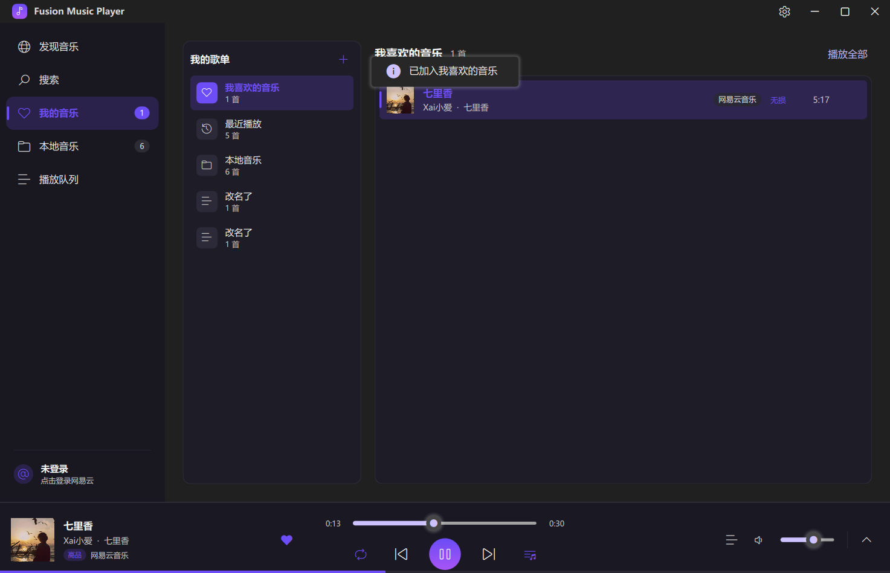
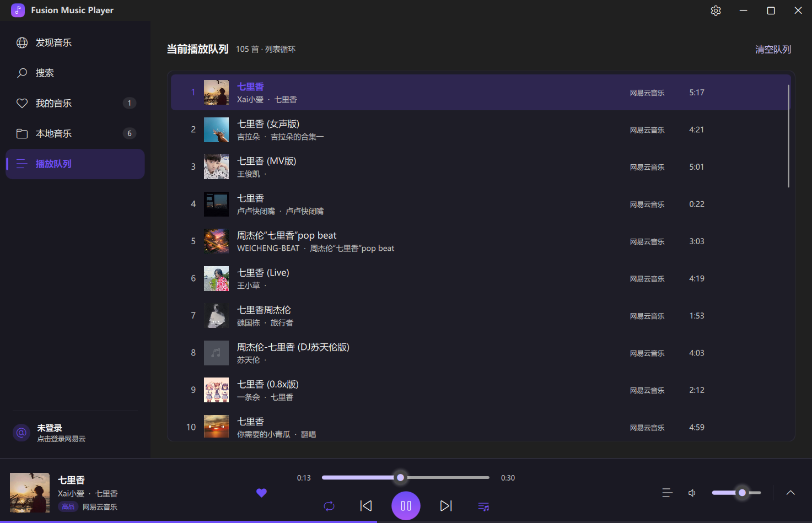
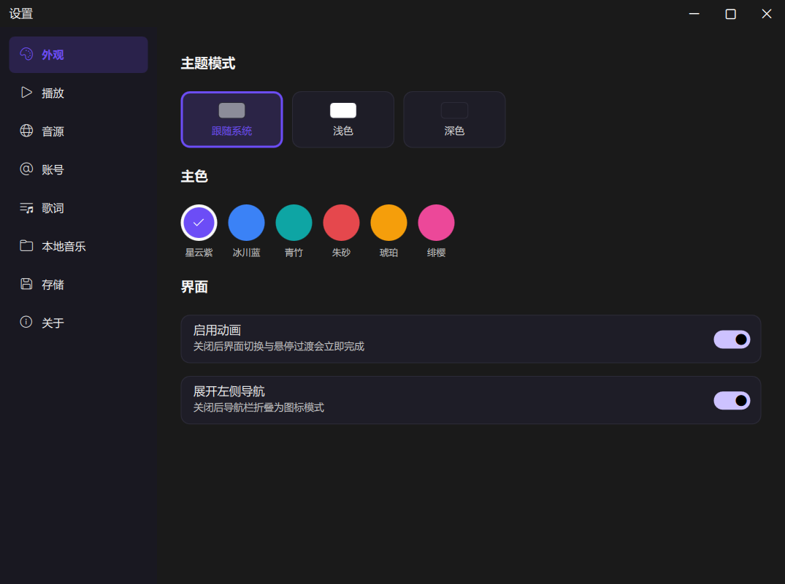
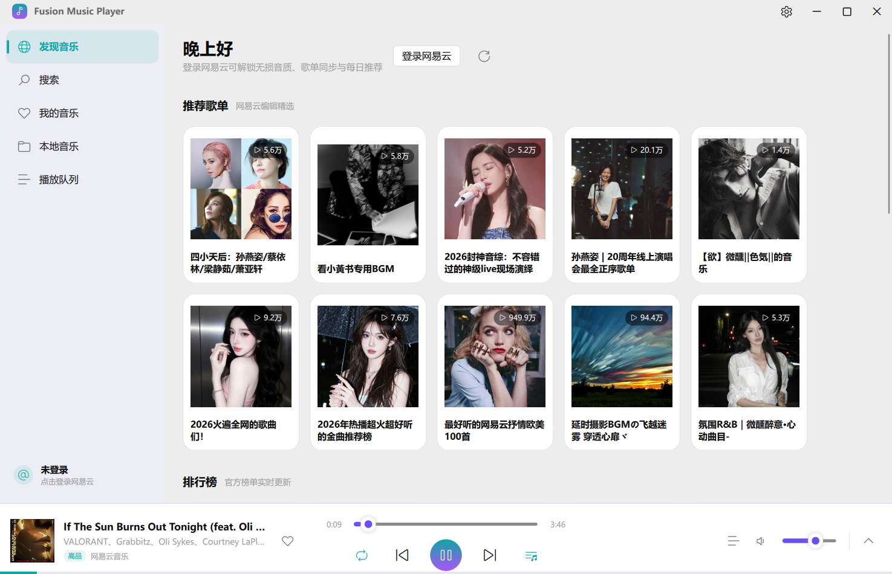
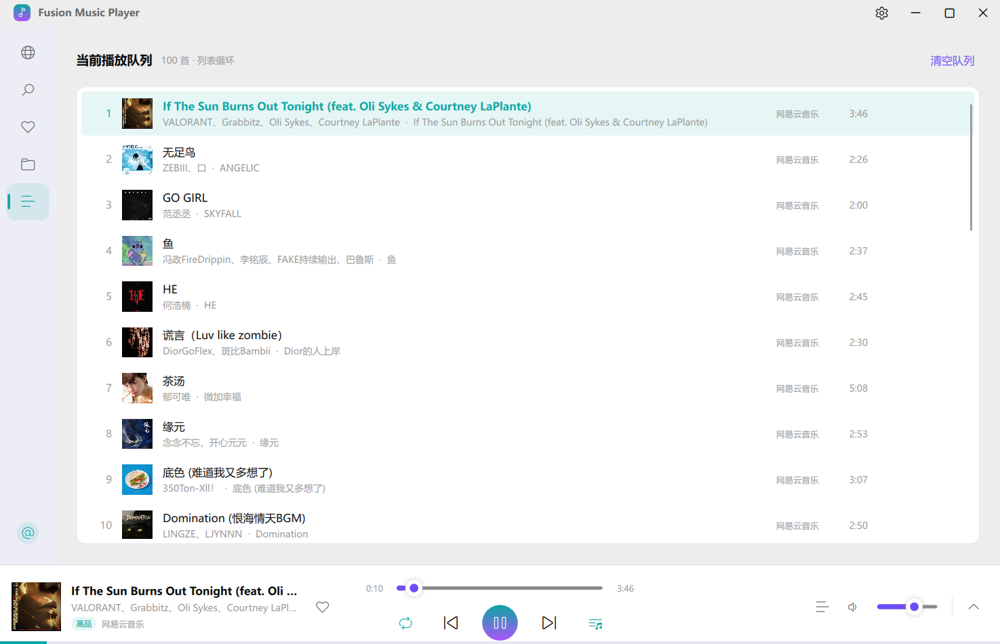

# Fusion Music Player

从 [FMCL](https://github.com/Janson20/FMCL) 中把音乐播放器完整拆出来，
用 **PySide6 + FluentUI QML** 重新实现的独立桌面音乐播放器。

网易云登录凭据以 **AES-256-GCM 认证加密**保存在**程序所在目录**下，
整个应用是绿色便携的：拷贝目录即可带走全部数据。

---

## 界面

完全对照设计草图：标题栏（品牌 + 设置按钮 + 系统按钮）、左侧标签页导航、
主界面、底部播放栏（封面 / 传输控件 / 展开箭头），底部栏可向上展开为
「大封面 + 歌词 / 歌曲百科」的播放页。

窗口尺寸**按屏幕可用区域（已排除任务栏）算**，不是写死的：小屏（1366×768 被
任务栏吃掉一截、或者 125% 缩放）下自动缩到装得下，连最小尺寸也一起让位，
免得底部播放栏被顶到屏幕外面点不到。设置 / 登录窗口同理。

| 发现音乐 | 搜索 |
|---|---|
|  |  |

| 展开播放页（歌词） | 展开播放页（歌曲百科） |
|---|---|
|  |  |

| 歌单详情 | 我的音乐 |
|---|---|
|  |  |

| 播放队列 | 设置 |
|---|---|
|  |  |

| 网易云登录 | 浅色主题 |
|---|---|
|  |  |

| 折叠导航 | |
|---|---|
|  | |

```
┌──────────────────────────────────────────────────────────────┐
│ ◈ Fusion Music Player                       ⚙   −   □   ✕    │  标题栏
├────────────┬─────────────────────────────────────────────────┤
│  标签页     │                  主界面                          │
│  发现音乐   │      （发现 / 搜索 / 我的音乐 / 本地 / 队列）      │
│  搜索       │                                                 │
│  我的音乐   │                                                 │
│  本地音乐   │                                                 │
│  播放队列   │                                                 │
├────────────┴─────────────────────────────────────────────────┤
│ (封面) 曲名/歌手  ⏮  ▶  ⏭   ─────●─────  🔊 ────  ≡    ⌃     │  播放栏
└──────────────────────────────────────────────────────────────┘
```

支持浅色 / 深色 / 跟随系统三种主题与 6 套预设主色（可自定义），
导航栏可折叠为图标模式。

---

## 快速开始

```bash
pip install -r requirements.txt
python main.py
```

数据默认落在 `./data/`；也可以用参数或环境变量指定：

```bash
python main.py --data-dir D:\Music\FusionData
set FUSION_MUSIC_HOME=D:\Music\FusionData && python main.py
```

### 可选依赖

* `pypinyin` —— 中文歌单按拼音排序（缺失时退化为字符序）
* `qrcode` + `pillow` —— **扫码登录必需**，缺失时只能用手机号或 Cookie 登录

---

## 功能

### 音源
* 网易云音乐、QQ音乐、酷我、酷狗、咪咕并发搜索，结果按音源分页展示
* **跨源兜底**：当前音源无版权 / VIP 限制时，自动在其它平台按
  「歌名 + 歌手」搜索、**以 15 秒时长容差排除翻唱与伴奏**，找到可用版本继续播放
* 音质自动降级链：同源档位回退 → 跨源重试（高音质优先）
* B 站音源默认仅参与兜底（其构造需要联网抓取 buvid，已改为惰性加载）

### 漫游
* 一条**持续生成的个性化推荐流**：登录后走网易云私人 FM（`/api/v1/radio/get`），
  每次 3 首、连打就是取之不尽的流；未登录或接口降级时退到每日推荐、推荐新音乐
* 服务端给的**推荐理由**直接显示在曲目行上（「你关注的音乐人新歌」「NO.43 飙升榜」
  「你可能喜欢的二次元歌曲」…），这也是它和「随便放一批歌」的区别
* **会自动续**：从漫游页开始播放后，队列剩不到 2 首时自动再取一批塞进队列，
  一直播下去；去听别的歌则自动交棒，不会往队列里偷塞歌
* 「换一批」换方向、「再多来点」往下接；推荐理由只在界面上显示，
  **不会跟着歌单 / 收藏落盘**（`Track.reason` 不进 `to_dict`）

### 播放
* `QMediaPlayer` 流式播放，**不需要像 FMCL 那样先整首下载**
  （仅当音源要求自定义请求头时才下载到缓存再播）
* 4 种播放模式：顺序 / 列表循环 / 单曲循环 / 随机（真洗牌，不重复）
* 单一队列模型（FMCL 是「文件夹列表 + 歌单上下文」双轨，自然播完时会串烧到文件夹的下一首）
* 淡入淡出、静音记忆、上一首回溯真实播放历史
* **启动时恢复上次的播放**：把上次退出时的队列、播放模式与在播曲目原样摆回来，
  进度也接着上次（设置 → 播放行为里可关）。恢复出来**不会自己出声** ——
  恢复的是状态不是播放动作，按播放键才开始；按之前拖进度条也不会被
  「上次听到哪儿」顶掉
* 播放失败自动跳过，跨源兜底时在界面提示已切换的音源
* 下载内容的**文件头 + 时长**双重校验，避免把 HTML 错误页或 VIP 试听片段当成完整歌曲

### 音量均衡
* 按 **EBU R128 / ITU-R BS.1770-4** 实测每首曲目的**门限积分响度**（LUFS），
  播放时自动把音量拉齐 —— 不同音源、不同年代的母带响度差个 3~6 LU 很常见，
  实测过的本地曲库从 −9.7 到 −12.6 LUFS 都有
* 增益**按峰值防削波**：抬升后不许越过 −1 dBFS，测不出响度的曲目一律不处理（0 dB），
  绝不凭峰值瞎猜一个增益
* 覆盖**本地与在线**曲目：本地文件直接解码；在线曲目解码它自己的播放地址
  （够用就断开，不必整首拉完）。个别音源的地址需要 Referer 之类请求头、
  解码器打不开时，会退回「带音源请求头下载一段再分析」
* 实测在真机上：133 秒 FLAC 全曲分析约 0.5~3 秒（解码 + K 加权都是 C 侧
  重采样 + 纯 Python 紧循环，4M 样本/秒），**在主线程里分片跑**（每轮最多 8 ms），
  界面不卡；结果进 `data/loudness.json` 缓存，同一首歌只算一次
* 默认目标 **−14 LUFS**（流媒体通行口径），可在设置里选 −18 / −16 / −14 / −12 / −10，
  也能关掉「允许抬高偏轻的曲目」（关掉后只压低、绝不抬升）
* **预取下一首**：切歌时增益已经就绪，不会「先响一下再被压下去」；
  跟随切歌即时取消上一首的分析，不浪费 CPU 与带宽
* 设置 → 播放 → 音量均衡 里能看到已分析曲目数、平均响度、占用空间，
  以及**当前曲目的增益来源**（实测 / 标签 / 音源估计），可一键清空重算
* 与音量滑块、淡入淡出**互不干扰**：滑块读的始终是用户音量，三个因子相乘后才交给
  `QAudioOutput`（滑块不会因为后台算出一个增益就自己跳）
* 已知边界见「已知限制」一节（不做动态压缩、用户音量拉满时抬升空间有限等）

### 自动更新
* 启动后**静默检查**（延迟 8 秒，别和启动时的取数据抢带宽），之后按间隔
  （默认 24 小时，可选 6 小时 / 每天 / 3 天 / 每周）复查；也可以随时手动检查
* 只提示、**不会偷偷装**：检查到新版本后在「设置 → 关于 → 更新」里显示版本、
  发布日期与更新说明，由用户点「下载更新」与「立即安装并重启」
* 下载**必须**通过 SHA-256 校验（用 GitHub Releases API 给每个资产提供的
  `digest`）：摘要缺失、对不上、或地址不在 GitHub 域名内（且必须是 https），
  一律**拒绝自动安装**，降级成「打开发布页」手动下载
* 安装方式按发行形态自动选：便携版（zip）换整个程序目录，单文件版换那个 exe；
  更新由 `data/updates/` 下的脚本在程序**退出之后**执行（Windows 上运行中的
  exe / DLL 换不掉），替换前整份备份程序文件、出错自动回滚并重新拉起旧版本
* **用户数据一个字节都不动**：备份与覆盖都排除 `data/` 目录（默认数据就在程序目录里，
  一次「顺手清理多余文件」就等于清空歌单与登录态）
* 源码运行、非 Windows、程序目录不可写时会说明原因并只提供「打开发布页」
* 上次更新成没成有结论：更新前写下的标记会在下次启动时核对版本号，
  失败时把更新日志的末尾几行直接摆到界面上

### 网易云账号
* **扫码登录**（本地渲染二维码，与 FMCL 一致，不请求任何二维码图片接口）
* 手机号 + 短信验证码登录
* 手机号 + 密码登录（网易已逐步下线该方式，服务端返回 `502` 时会给出明确提示）
* 手动粘贴 Cookie 登录
* 登录后解锁无损 / Hi-Res、翻译歌词与罗马音、账号歌单
* 会员标签按客户端写法显示：**「黑胶SVIP·肆」**而不是「黑胶SVIP Lv4」
  （等级用中文大写数字；等级是服务端给的，超出 1..99 时原样退回阿拉伯数字。
  设置页那行排查用的明细里仍保留服务端的 `等级 Lv4`，报问题时能对得上）
* 凭据加密保存在程序目录，启动自动恢复；**临近过期自动续期**
  （默认剩余不足 7 天时向 `/api/login/token/refresh` 换发新凭据，可在设置里关掉），
  设置页能看到有效期、也能手动续期
* **便携模式**（设置 → 账号）：打开后主密钥不再绑定本机，整个程序目录拷到别的
  电脑 / 别的 Windows 用户下账号照样是登录状态；拨动开关不用重新登录
  （详见「凭据加密」一节）
* 服务端明确回报凭据失效时，界面直接置为未登录并提示重新登录
  （网络不通**不会**清登录态，两种情形分得很开）

### 音乐库
* 自建歌单（新建 / 重命名 / 删除 / 清空 / 排序 / 手动调序）
* 「我喜欢的音乐」（FMCL 完全没有本地收藏）与「最近播放」历史
* 本地音乐扫描（`mutagen` 读取标签与时长），支持同目录 `.lrc` 字幕
* 全部落盘在程序目录，原子写入，解析失败时备份为 `*.corrupt` 而不是丢弃

### 本地音乐
* 添加文件夹用**系统文件夹选择器**（`QtQuick.Dialogs` 的 `FolderDialog`），
  不用手打路径 —— 选出来的是 `file://` URL，Python 侧统一归一化
* 扫描读标签与时长之外，还会读**文件里内嵌的封面**（MP3 的 ID3 `APIC`、
  FLAC/Ogg 的 `pictures`、MP4 的 `covr`），落进封面缓存后直接当封面用
* 标签里的**多歌手分隔符归一成「、」**（`&` `;` `/`），与在线音源同一套规矩：
  标签写着「洛天依/乐正绫」时界面上才是两个可点的歌手 —— 少了这一步它会被当成
  **一个**歌手，显示成一串、点进去还会去找「洛天依/乐正绫」这个不存在的名字
  （界面弹「没找到歌手」）。老曲库 / 老的收藏与历史在**读盘时顺手迁移一次**，
  不必为了这个重新扫描
* 剩下的**按「歌名 + 歌手」在线匹配**网易云：歌名对得上 + 时长在 15 秒内才算，
  匹配上就补上专辑封面，并记下这首歌在网易云的**身份**
* **歌词不在扫描阶段抓**：几千首本地歌就是几千个请求，所以只记身份，
  播放时才按它去取歌词（翻译 / 罗马音照旧）。同目录有 `.lrc` 时优先用本地的
* 匹配结果跟着 `local.json` 落盘；重扫按「路径 + 时长」沿用，不重复搜索，
  文件被换成别的歌（时长变了）才重新匹配
* 扫描分两段，界面按阶段显示进度（`扫描文件 120/850`、`匹配封面与歌词 300/850`）
* 曲库很大时首次匹配会慢一些，可在「设置 → 本地音乐」关掉自动匹配

### 歌手 / 专辑
* **任何地方的歌手名 / 专辑名都能点**：曲目行、播放栏、展开播放页，右键菜单里
  还能在多位歌手里挑一位（「查看歌手 → 洛天依」）
* **歌手多于 3 位时自动折叠**成「前几位 / 等 N 人」：企划曲、周年纪念集合辑挂
  十几个歌手很常见，而歌手行是按名字逐个排的 `RowLayout`（**不会换行**），
  不折叠的话整行会被撑到窗口两边、横着盖住封面与歌词。展开播放页的栏窄，
  只铺开 2 位；点「等 N 人」列出完整名单，每一位都能点进歌手页
  （曲目行那层不进菜单 —— 同一行的右键菜单里已经有「查看歌手」了）
* 曲目行的宽度还会**逐项省略**（`elide`）而不是溢出：整行宽度取
  `min(自身所需, 可用宽度)`，放得下就自然排，放不下才收缩，专辑名始终紧跟在
  歌手后面（只给子项 `fillWidth` 的话，多出来的宽度会被分给歌手名，
  专辑名被推到行尾，看着像两个不相干的字段）
* 歌手页：圆形头像、别名、单曲 / 专辑 / MV / 粉丝数、简介，加热门歌曲列表
  （最多 50 首，可「播放全部 / 添加到队列 / 全部收藏」）
* 专辑页：封面、专辑名、**可点的歌手**、发行日期与唱片公司、简介，加整张曲目列表
  （同样可一键播放全部 / 入队 / 收藏）
* 歌手与专辑互相可跳：专辑页点歌手名进歌手页，歌手页点专辑名进专辑页，
  返回键一层层退回来（`Esc` 也是先关最上面那层）。
  两个覆盖层的上下关系按**打开顺序**来（每次打开领一个递增的 `layer`，界面拿它当
  `z`）—— 按 QML 声明顺序排的话，歌手页永远压着专辑页，从歌手页点专辑名就会
  打开一个被盖住的页面，看起来像「点了没反应」
* 搜索的「全部」标签页置顶一张歌手卡片和一张歌单卡片（对应网易云的「综合」），
  点了直达歌手页 / 歌单页
* 其它音源（QQ / 酷我 / 酷狗 / 咪咕 / 本地文件）没有网易云的歌手 / 专辑 id，
  所以统一**按名字定位**；专辑还会拿**专辑名核对** id —— 别的平台的数字 id
  直接丢给网易云很可能撞出一张风马牛不相及的专辑
* 两个页面都只做「歌曲」这一页：专辑 / MV / 相似歌手 / 评论 / 点赞这些
  **没做**（各自要独立的接口与页面来承接）

### 歌词
* LRC 解析沿用 FMCL 的正则与时间规则
* **翻译与罗马音真正接上**（FMCL 请求了却只读主歌词，翻译永远是空的）
* 当前行自动滚到中央、高亮、逐行平滑过渡
* 歌词文字**默认居中**，可在「设置 → 歌词 → 对齐方式」改成靠左 / 靠右

### 歌曲百科
* 展开播放页右侧的卡片上有「歌词 / 百科」两个标签页，与网易云客户端的歌曲详情页一致
* 曲风 / 语种 / BPM / 推荐标签 / 获奖成就 / 影视节目 / 乐评来自网易云的
  **百科区块页**（`/api/song/play/about/block/page`，走 eapi 通道）；
  同一个响应里还有相似歌曲与相关歌单，不属于这个面板，直接丢掉
* 「**发行时间 / 发行版本**」根本不在百科接口里 —— 它们是专辑详情的
  `publishTime` 与 `subType`（实测 2026-09-19：「塔与少女的无题诗」→ `2018-11-30` /
  `录音室版`，与客户端显示一致），所以在这里合流。**行的顺序也由客户端定**
  （发行信息插在「语种」和「BPM」中间），不跟着服务端返回的顺序走
* 「曲风」是 `父类-子类` 的两级结构，按客户端的画法渲染成 `二次元·歌声合成`
* 其它音源（QQ / 酷我 / 酷狗 / 咪咕 / 本地文件）没有网易云的歌曲 id，
  按「歌名 + 歌手」搜一次再**核对歌名与时长**（15 秒容差）后才认，
  核对不过就当作这首歌没有百科 —— 与歌手页 / 专辑页同一套「按名字定位」思路
* **懒加载**：只有面板展开、且真的停在百科标签上时才去取数，
  否则每切一首歌都要白跑一次请求（还顺带搜一次歌曲、一次专辑）
* 换歌时旧数据立刻作废（不这么做，切回百科的那一瞬间会先闪一下上一首的百科）

### 窗口与托盘
* 关闭主窗口时按设置走：**每次询问 / 最小化到托盘 / 直接退出**（默认每次询问）。
  询问框里可以勾「记住我的选择」，之后不再问 —— 那一刻就等于在设置里改了，
  设置页（外观 → 窗口）里随时能改回来
* **最小化到托盘**是 `hide()` 而不是关掉：播放不中断，托盘图标点一下就回来；
  设置 / 登录窗口会跟着一起收走，免得主窗口进了托盘它们还杵在桌面上
* 托盘图标常驻（设置里可关）：左键 / 双击回主窗口，右键菜单直接
  「显示主窗口 / 播放·暂停 / 上一首 / 下一首 / 退出」，悬停显示当前歌名与歌手
* 托盘图标与窗口图标都从**打包进程序的资源**里取（`paths.resource_dir()`）：
  PyInstaller 6 的 onedir 把 `assets/` 放进 `_internal/`，onefile 放进
  `%TEMP%\_MEIxxxx`，**都不在 exe 旁边** —— 按 exe 目录去找的话，打包版启动正常、
  托盘上却是一个没有图标的空白位（源码运行看不出来，只有打包后才复现）
* 托盘用 QML 的 `Qt.labs.platform`（系统原生菜单），**不引入 QtWidgets**：
  `QSystemTrayIcon` 的上下文菜单只吃 `QMenu`，而 `QMenu` 是 QWidget，用它就得把整个
  程序从 `QGuiApplication` 换成 `QApplication`；而且主窗口藏进托盘之后，QML 自己的
  `Menu` 是画在窗口里的，没地方画
* 系统没有通知区域（部分 Linux 桌面、离屏环境）时**自动降级**：设置里的托盘开关
  灰掉，「最小化到托盘」一律按「直接退出」处理 —— 没有托盘还把窗口藏起来的话，
  用户就再也找不回这个程序了（这条判断是纯函数 `close_decision()`，有离线回归）
* 退出走的是 `QGuiApplication.exit(0)`，**不是 QML 的 `Qt.quit()`**：托盘图标只要
  露过面，`Qt.quit()`（= `QCoreApplication::quit()`）就会被吞掉 —— Qt 有意让
  「有托盘的程序」不因窗口关闭而退出（托盘的意义就是窗口关了程序还在），而
  `quit()` 尊重这层拦截。用它的话点了「退出程序」毫无反应，用户再点一次 ✕ 又弹
  一遍询问框，看起来就是个死循环。`exit(0)` 是 `quit()` 文档里写的等价物，只是
  不受拦截影响，`aboutToQuit`（存档那一步）照样会发
* 退出前**先把窗口收掉再退**：拆引擎（媒体后端、整棵 QML 对象树、托盘图标）要花
  一秒上下，窗口留在屏幕上会显示成「未响应」；先 `hide()` 掉窗口，界面当场消失、
  进程随后无声退出 —— 与改动前「点关闭秒退」的观感一致

### 启动画面与启动速度

程序**点开就有反馈**：进程起来约 130–170 ms 后启动画面出现在屏幕中央，
主窗口首帧渲染完成时淡出（最少停留 400 ms，免得一闪而过）。

* 画面由 `app/splash.py` 用**纯 Win32（ctypes + GDI）**画出来，**不依赖 Qt**。
  这不是为了炫技：源码运行从进程创建到主窗口首帧要 1.4 秒上下，这段时间里
  Qt 窗口**根本还不存在**（PySide6 导入 ~0.25 秒 + QML 编译 ~0.7 秒），
  想在此之前给用户一点反馈，就只能自己调系统 API（用 Qt 画是"先等 Qt 起来"，
  等于没有）
* 窗口建在**独立线程**上（自带消息循环，`GetMessageW` 期间释放 GIL），
  主线程该 import 什么继续 import；`WS_EX_LAYERED` + `UpdateLayeredWindow`
  做逐像素透明，圆角与图标边缘平滑
* 底图是**生成物**：`tools/make_splash.py`（Pillow，只在开发/打包前跑）
  把卡片与图标渲染成 `assets/splash-{dark,light}.dat`（预乘 BGRA + zlib），
  运行时只做解压 + `AlphaBlend` 缩放 —— 于是**运行时零新增依赖**，
  仓库里也没有任何来源不明的二进制。改了脚本必须重新生成，
  `tests/test_startup.py` 会逐字节校验两者是否还对得上
* 状态文字（「正在加载界面…」）与进度条由 GDI 按屏幕 DPI **现画**，
  100% / 150% / 200% 缩放下都清晰（底图按 2 倍逻辑尺寸绘制，缩放后依然干净）
* 进度跟着真实阶段走：启动画面 → 加载组件 → 准备组件 → 加载界面 →
  恢复播放会话 → 首帧淡出；两个里程碑之间进度条会缓慢自行前移，
  不会停在同一个地方看着像死机
* 深浅色跟随 `data/config.json` 的 `appearance.theme`（`auto` 时读系统的
  应用主题，即设置 → 个性化里的浅色/深色），进度条用 `appearance.accent`
* 全程**不可交互**：不抢焦点、鼠标点穿、忽略关闭消息，也不在任务栏留按钮；
  而且它对启动流程**没有任何控制权** —— 拿不到资源、建窗失败、DPI 查询失败
  都只是「这次没有画面」，程序照常启动。`FMP_NO_SPLASH=1` 可显式关掉（CI / 自动化）

实测（本机，源码运行，进程创建 → 首帧可见，多次取样；数字会随磁盘缓存与
机器负载浮动，看量级即可）：

| 阶段 | 优化前 | 现在 |
| --- | --- | --- |
| 启动画面可见（有反馈） | —— | **130 ~ 170 ms** |
| import（PySide6 / FluentUI / 音源…） | 428 ms | ~250 ms |
| 装配（配置 / 曲库 / 播放器 / 11 个控制器） | 150 ms | ~160 ms |
| `engine.load(Main.qml)` | 1190 ms | ~720 ms |
| **首帧（真能用）** | ~2127 ms | **~1350 ~ 1520 ms** |

打包版（onedir，`pyinstaller build.spec`）热启动实测首帧 ~1.34 秒、冷启动 ~3.7 秒
（冷启动那一次是整包 200 MB 首次落盘），启动画面同样在几百毫秒内出现。

这 0.7 秒是这么省出来的（每一项都先量再改，数字见上表）：

1. **requests 延迟导入**：`import requests` 实测 0.4 秒（还要连带 urllib3 /
   charset_normalizer / certifi），而它只在真的去请求音源时才有用，原先却压在
   启动链上（`app.bridges.*` → `app.core.models` → `app.sources.base`）。
   `app/lazy.py` 提供一个模块代理，5 个模块的 `import requests` 改成
   `from ..lazy import requests`，**调用点一个字都不用改**（`requests.get`、
   `except requests.RequestException`、注解里的 `requests.Session` 全都照旧）。
   然后在进 `engine.load` 之前开一个后台线程把它预导进来：QML 编译那 0.7 秒
   主线程几乎都在 C++ 里、GIL 是空的，这 0.4 秒基本白捡。
   **预热的位置很关键** —— 放早了会和装配阶段抢 GIL，实测把装配从 150 ms 拖到 690 ms
2. **页面与子窗口惰性实例化**：`Main.qml` 里 6 个页面 + 设置窗口（1100 行）
   + 登录窗口（400 行）原本在启动时全部编译并实例化，实测占 `engine.load`
   约 0.3 秒，而首帧只看得到其中一个。现在页面走 `components/LazyPage.qml`
   （第一次切过去才加载；加载过就一直留着，切走**不销毁** ——
   搜索词、滚动位置、展开状态都得原样保留），两个窗口走 `Qt.createComponent`
   （`Loader` 装不了 `Window`）
3. **启动画面**：纯 Win32，Qt 侧一行都不用改（见上）

QML 编译缓存（`*.qmlc`）Qt 6 **默认就开着**，不需要额外配置
（实测强制打开没有收益，缓存目录里本来就有 60+ 个 `.qmlc`）。

### 设置
外观 / 播放 / 音源 / 账号 / 歌词 / 本地音乐 / 存储 / 关于，共 8 个分区
（窗口与托盘在「外观 → 窗口」里）。

---

## 开发与测试

```bash
python main.py                       # 运行
python tests/test_core.py            # 核心逻辑回归（离线，67 项）
python tests/test_startup.py         # 启动链回归（离线：启动画面资源 / 延迟导入 / 计时）
python tests/test_ui_smoke.py        # QML 界面冒烟（需要显示环境）
python tools/check_qml_signals.py    # QML 信号处理器静态检查
python tools/account_probe.py        # 排查网易云账号识别问题（不打印 Cookie）
```

启动耗时怎么量（改了启动链上的任何东西都该跑一遍）：

```bash
FMP_TRACE_STARTUP=1 python main.py         # 每个阶段立刻打一行到 stderr，同时写进日志
python tools/probe_startup.py src          # 外部观测：启动画面 / 主窗口 / 画面是否退场
python tools/probe_startup.py exe --repeat 3   # 打包版，3 次取中位数
python tools/make_splash.py --check        # 启动画面底图是否与生成脚本一致
```

`FMP_TRACE_STARTUP=1` 打的是**从进程创建算起**的绝对毫秒数（打包引导、解释器启动、
import、QML 编译全算在内），不是各阶段自己的耗时 —— 只有这个数字才等于用户等待的时间。

几个**可行性探测脚本**（都是量测性质，改动了相关模块之后可以用来复核；不参与打包）:

```bash
python tools/probe_audiodecoder.py [文件]   # QAudioDecoder 能否解成 8kHz 单声道 float
python tools/probe_loudness_cost.py [文件]  # 真机上解码 + 纯 Python 响度运算的耗时
python tools/probe_stream_decode.py [url]   # 能否直接解 https 流并在够用后断开
python tools/probe_startup.py src|exe       # 启动耗时（启动画面 / 主窗口 / 画面退场）
python tools/validate_loudness.py           # 响度实现 ↔ pyloudnorm 交叉验证（见下）
```

`tools/validate_loudness.py` 需要一份**独立环境**（它要 numpy/scipy/pyloudnorm，
而本项目刻意不引入这些依赖）::

```bash
python -m venv %TEMP%\fusion_loudness_ref
%TEMP%\fusion_loudness_ref\Scripts\python -m pip install pyloudnorm numpy scipy
%TEMP%\fusion_loudness_ref\Scripts\python tools\validate_loudness.py
```

它做三件事：核对自研的 K 加权系数与 BS.1770-4 附录逐位一致；用正弦 / 噪声 /
双电平 / 静音+峰值等信号比对门限积分响度（改过滤波或门限之后务必跑一遍 ——
响度算错不会崩，只会让「均衡」变成「忽大忽小」）；8 kHz 与 48 kHz 两种采样率都测。

`tests/test_core.py` 覆盖凭据加密仓库（往返、篡改检测、缺文件、便携模式开关不换
密钥、换机后便携的可解/绑定的报错、重建密钥、凭据路径跟着数据目录走）、
LRC 解析（补零、offset、一行多标签、翻译配对、当前行二分与缓存）、
播放队列（四种播放模式、洗牌不重复、历史回溯、增删移动、序列化）、
播放会话（队列 / 下标 / 模式 / 进度往返，手改坏的文件、越界下标、认不出的版本
一律退成「没有会话」而不是把界面带崩）、会员等级的中文数字后缀、
关闭主窗口的策略（没有托盘时一律退出，不能把窗口藏得找不回来）、
歌曲百科解析（取值位置随字段类型而变、行顺序、空数据降级、按名字选曲核对）、
歌手名的拆分与迁移（本地标签里的 `/` `&` `;` 归一成「、」、老曲库读盘时自动修）、
窗口尺寸夹取（小屏 / 无显示器 / 脏数据）、本地音乐匹配规则（何时去搜、
内嵌封面优先、重扫沿用要看时长）、内嵌封面读取（真的造一个带 ID3 封面的 mp3）、
**响度测算**（48 kHz 的 K 加权系数与 BS.1770-4 附录逐位一致、已知正弦的 LUFS、
相对门限必须在能量域取平均、静音 / 过短 / NaN 的边界、分块喂样本与一次性分析一致、
增益的峰值防削波与上下限、测量缓存的往返与失败重试窗口、音源中位增益兜底）、
**自动更新**（版本号解析与预发布比较、按发行形态挑资产、站外地址与 http 一律拒绝、
SHA-256 校验、发行形态判定、更新脚本必须排除 `data/` 且失败回滚、解压防目录穿越）
与曲目模型，**不依赖 Qt 界面也不联网**，可直接交给 pytest。

`tests/test_startup.py` 守的是启动链上那些「改一行就悄悄退化、平时看不出来」的东西：
`assets/splash-*.dat` 与 `tools/make_splash.py` 的输出是否**逐字节一致**（底图是生成物，
改了脚本忘了重新生成的话，界面只会继续用旧图）、底图是否满足**预乘 alpha**
（不满足的话半透明边缘会发白）、布局是否落在卡片内部（补 alpha 依赖这条）、
`load_art` 碰到损坏文件是否老实返回 `None`、主题与强调色是否跟着 `config.json` 走、
延迟导入代理是不是真的延迟，以及**最关键的一条**：在干净子进程里
`import app.application` 不许把 `requests` 拉进 `sys.modules` —— 那 0.4 秒就是这么丢的。
同样是离线测试，不依赖 Qt 界面也不联网。

`tests/test_ui_smoke.py` 会启动真实界面并校验窗口、导航与覆盖层行为，守住这些
曾经真实出现过的缺陷：设置 / 登录窗口跟着主窗口一起弹出来；关闭后无法再打开
（`Cannot call method 'showWindow' of null`）；歌单详情页左上角「返回」点了没反应
（信号发了但没人接）；展开播放页与歌单详情覆盖层的空白处会把鼠标事件放过去、
点到底下的导航栏；隐藏歌词后封面区赖在左边不居中；歌词写死靠左；百科标签页切过去
歌词还盖在原地、或者没打开百科页就去联网取数；本地音乐页又退回成手输路径的输入框；
点歌手名 / 专辑名进不去对应页面（或者反过来，被整行的「播放」抢走点击；
再或者层级放错，打开了却盖在底下看不见）；漫游刚点开始就自己关掉（换队列时
「当前曲目」还是上一首，被自己的交棒判断误伤）；恢复出来的曲目点了播放没反应
（媒体还没交给播放器，`play()` 是空操作）、或者进度没接着上次走；关闭主窗口
没有把关闭事件拦下来（窗口被销毁、进程也跟着退了，或者反过来 —— 托盘用不了
却把窗口藏了起来，用户再也找不回程序）；点「退出程序」退不出去（托盘图标露过面
之后 `Qt.quit()` 会被吞掉，用户再点 ✕ 又弹一次询问框，看着像死循环）；
音量均衡把滑块带跑（`QAudioOutput.volume()` 是「用户音量 × 淡入淡出 × 均衡增益」的
乘积，滑块必须绑用户音量那一项）；自动更新在源码运行时也走自动安装这条路
（本该只提供「打开发布页」）。
**它只在本地跑**，不进 CI：

```bash
python tests/test_ui_smoke.py
# 无显示环境（Linux CI / 服务器）：
xvfb-run -a python tests/test_ui_smoke.py
# Windows 上桌面会话状态不对时（远程 / 无人值守）：
$env:QT_QPA_PLATFORM="offscreen"; python tests/test_ui_smoke.py
```

> 桌面会话被挡住 / 无人值守时，窗口拿不到绘制帧，**QML 的动画就不推进**
> （`opacity` 一直停在 0），于是「面板没展开」「点击不生效」这类假故障会成片出现，
> 甚至卡在事件循环里 —— 代码没变，换个时间跑又全绿。遇到这种情况先用
> `QT_QPA_PLATFORM=offscreen` 复核一遍；它顺带把屏幕报成 800×800，
> 正好也压一遍小窗口下的布局。

CI 里跑它需要在 ubuntu runner 上装一整套 Qt 的 X / OpenGL / 音频系统库
（`libegl1`、`libva2`、`libpulse0`、gstreamer 等，装一次好几分钟），
为了省 runner 时间就没放进去 —— 本地跑一次只要十几秒。

`tools/check_qml_signals.py` 是纯静态检查（不需要 Qt 运行时），专门拦已废弃的
信号参数注入：

```qml
// ✗ Qt 6.7+ 会报 Parameter "pageId" is not declared
onPageRequested: app.go(pageId)
// ✓
onPageRequested: function (pageId) { app.go(pageId) }
```

它会自动收集项目里所有 `signal foo(Type name)` 的参数名，再找出依赖注入的
处理器。这条检查留在 CI 里，因为它能覆盖全部 QML 文件，而界面冒烟测试只在本地跑。

代码风格：`python -m pyflakes main.py app/*.py app/bridges app/core app/security tests`

> `app/sources/` 下取自 FMCL 的 8 个文件保持与上游逐字一致（仅改相对导入），
> 因此 `pyflakes` 会对其报出上游原有的未使用导入与变量，这是有意保留的，
> CI 也只对本项目自有代码做门禁。
>
> 例外是 `base.py` / `utils.py` / `wy.py` 里的 `import requests`：为把 0.4 秒的
> 导入开销移出启动链，它换成了 `from ..lazy import requests` 的延迟代理，
> 并补上 `from __future__ import annotations`（否则注解里那些
> `requests.Session` 会在 def 时求值，等于没延迟）。逻辑与调用点均未改动，
> 三处都已在文件头注明。

---

## 打包与发布

### 本地打包

```bash
pip install -r requirements-dev.txt
python -m PyInstaller build.spec --noconfirm            # 目录模式，启动快
$env:FMP_ONEFILE="1"; python -m PyInstaller build.spec  # 单文件模式
python tools/audit_bundle.py dist/FusionMusicPlayer     # 校验依赖是否齐全
```

产物在 `dist/`。目录模式约 204 MB，单文件模式约 100 MB 出头。

`build.spec` 里有三处容易踩的坑，都写在注释里了：

* `app/sources` 的音源是 `importlib` 动态导入的，必须手写进 `hiddenimports`，
  否则打包后一搜索就报「音源加载失败」；
* 不能用 `collect_submodules("qrcode")` —— 它会连带拉进 numpy / lxml / scipy
  （`qrcode.image.styledpil` 用 numpy），体积凭空多出 80 MB；
* PySide6 的 hook 会把整个 Qt 目录收进来（含 195 MB 的 `Qt6WebEngineCore.dll`），
  必须在 `EXE/COLLECT` 之前过滤 `Analysis.binaries`；但 **`Qt6ShaderTools.dll`
  不能删** —— FluentUI 的 `FluClip` 经由 `Qt5Compat.GraphicalEffects` 依赖它。

另外，本地音乐页的系统文件夹选择器用的是 `QtQuick.Dialogs`（QML 里 import 的，
Python 侧看不到），打包时 `Qt6QuickDialogs2*.dll` 与 `qml/QtQuick/Dialogs/`
都要留着 —— 它们不在 `DROP_QT_DLLS` / `DROP_DATA_PARTS` 里，默认会被收进来，
别手滑加进去。

**找资源要用 `paths.resource_dir()`，不是 `program_dir()`**：PyInstaller 6 的
onedir 把数据文件（`assets/`、`app/ui/`、FluentUI 的 qml）放进 `_internal/`，
onefile 放进 `%TEMP%\_MEIxxxx`，两者都不在 exe 旁边 —— 实测打包后
`dist/FusionMusicPlayer/` 下只有 exe 与 `_internal/`。
`program_dir()` 是给**用户数据**用的（`data/`、`downloads/`，必须挨着 exe 放，
这样才是绿色便携的）。用错地方的后果是「源码跑得好好的、打包后托盘图标空白」，
启动日志里现在会写明两者的实际路径，并单独告警图标没找到。

`tools/audit_bundle.py` 会遍历产物里每个 DLL/PYD，解析 PE 导入表并报告
「既没打包、也不属于 Windows 系统」的依赖。上面那条 ShaderTools 就是这么
发现的——它只在运行时报「无法加载库」，静态检查完全看不出来。

### 发布流程

版本号的唯一来源是 `app/_version.py`（入库），发布流水线在打包前会依据
git tag 再覆写一次，两者由 `scripts/release.py` 保证同步。

一条命令完成发版（参考 FMCL 的 `scripts/release.py`）：

```bash
python scripts/release.py patch          # 1.0.0 -> 1.0.1
python scripts/release.py minor          # 1.0.0 -> 1.1.0
python scripts/release.py 1.2.3          # 指定版本号
python scripts/release.py patch --dry-run   # 只预览
python scripts/release.py patch --no-push   # 提交并打 tag，但不推送
```

它会依次：校验工作区干净 → 确认分支与标签未被占用 → **跑核心测试**
（不通过就中止）→ 更新 `app/_version.py` → 提交 `chore: release vX.Y.Z`
→ 打**附注标签** → 推送分支与标签。

推送 tag 后 GitHub Actions 自动执行：

```
build-windows → release
```

1. **build-windows**：注入 tag 版本号 → 打包目录版与单文件版 → 20 秒启动自检
   → 打成 ZIP / EXE；
2. **release**：按约定式提交聚合 changelog（✨ 新功能 / 🐛 修复 / 💡 改进 /
   📝 其它），用 `softprops/action-gh-release` 建 Release 并附上下载表格。

**发版流程刻意做得很轻**：不跑测试门禁、不做多平台矩阵。测试在 `ci.yml` 里
（push / PR 时跑，单 job，一分钟内结束），发版时不重复跑一遍，省 runner 时间。

唯一保留的是一个 20 秒的启动自检，而且设成了 `continue-on-error` ——
**只报告、不阻断**。打包出来的程序能不能起来本地不一定复现（很容易漏收一个
Qt 插件 DLL，我就踩过一次），有这条 warning 至少能立刻看到。不想要就把
`Boot check` 那一步删掉。

发布产物：

| 文件 | 说明 |
|---|---|
| `FusionMusicPlayer-<版本>-win-x64.zip` | 便携版，解压即用，启动更快 |
| `FusionMusicPlayer-<版本>-win-x64.exe` | 单文件版，首次启动需解压，稍慢 |

> 也可以手动推 tag（`git tag -a v1.2.3 -m "..." && git push origin v1.2.3`）。
> 这种情况下如果 `app/_version.py` 与 tag 对不上，流水线只会打一条 warning，
> 打包仍按 tag 的版本号走 —— 产物里的版本号永远是对的。

`.github/workflows/ci.yml` 在 push / PR 上只跑一个 job：pyflakes 门禁 +
核心测试（约一分钟）。**不在这里做 PyInstaller 打包** —— 每次提交都完整打一次包
既慢又没必要，打包问题交给发版时的 `build-windows` 去暴露。

macOS / Linux 未提供预编译包，从源码运行即可（`pip install -r requirements.txt && python main.py`）。

---

## 键盘快捷键

| 快捷键 | 功能 |
|---|---|
| `Space` | 播放 / 暂停（输入框聚焦时不触发） |
| `Ctrl + ← / →` | 上一首 / 下一首 |
| `Ctrl + ↑ / ↓` | 音量 ±5 |
| `Ctrl + F` | 跳到搜索页 |
| `Esc` | 收起展开播放页 / 关掉最上面的覆盖层（歌手页 / 专辑页 / 歌单详情） |

---

## 数据目录

默认 `./data/`（程序所在目录），全部内容如下：

```
data/
├── config.json          设置
├── credentials.enc      网易云凭据（AES-256-GCM，认证加密）
├── keys/master.key      主密钥（便携模式下为裸密钥，否则由 DPAPI 按当前用户保护）
├── playlists.json       歌单
├── favorites.json       我喜欢的音乐
├── history.json         播放历史
├── local.json           本地曲库索引（含在线匹配到的封面与曲目身份）
├── session.json         上次播放的队列 / 在播曲目 / 进度（退出时写掉，启动时读回）
├── loudness.json        音量均衡的响度测量值（按曲目 uid；删掉只是重新分析一遍）
├── updates/             自动更新：下载的安装包、解压暂存、替换脚本与回滚备份
├── cache/               封面 / 歌词 / 音频缓存（内嵌封面也落在这里）
└── logs/
    ├── fusion.log       运行日志（滚动，2MB × 4）
    └── update.log       自动更新的执行日志（替换脚本写的，出问题时先看它）
```

`data/updates/` 里的内容都是**可重建的中间产物**：安装包、解压出来的新版本、
替换脚本、上一版本的备份。程序每次启动都会清掉过期的暂存与只剩最后一份的回滚备份。
自动更新时这个目录会被明确排除在「备份与覆盖」之外 —— 用户数据一个字节都不动。

`session.json` 是可搬走的一次性状态：删掉它只是下次启动不再恢复上次的播放，
其余数据一概不受影响。关掉「设置 → 播放行为 → 启动时恢复上次播放」时它会被删掉；
清空播放队列后退出同样会删（否则「清空 → 退出 → 重开」会把上一次的队列捞回来）。

### 凭据加密

| 项目 | 实现 |
|---|---|
| 算法 | AES-256-GCM（认证加密，篡改必然解密失败） |
| 文件格式 | 带版本号的 JSON 信封：`format_version` / `cipher` / `kdf` / `salt` / `nonce` / `payload` |
| 主密钥 | `data/keys/master.key`，32 字节随机。存法由**便携模式**决定（见下） |
| 便携模式**开启** | 密钥文件写成 `PORT` + 裸密钥：整个程序目录拷到别的电脑 / 别的 Windows 用户下照样解得开，**账号保持登录** |
| 便携模式**关闭** | 密钥文件写成 `DPA1` + DPAPI（当前用户）包裹的密钥：拷到别的机器就解不开（更安全，但换机要重新登录） |
| 密钥派生 | 默认 HKDF-SHA256；设置 `FUSION_MUSIC_MASTER_PASSWORD` 后改为 PBKDF2-HMAC-SHA256（600,000 次迭代 + 随机盐），此时有无便携模式都一样跨机可移植 |
| 落盘 | 临时文件 + `os.replace` 原子替换；加密失败时**拒绝写入**而不是写明文 |
| 密钥文件损坏 | **绝不自动覆盖重建**，而是报错并保留原文件，避免旧凭据永久不可解 |
| 有效期 | 服务端给 `MUSIC_U` 的 Max-Age 约 **180 天**；剩余不足 `account.cookie_refresh_days`（默认 7）天时自动调 `/api/login/token/refresh` 换发新凭据，理论上只要不是长期不开就永远不用重新登录 |
| 失效处理 | 服务端确认失效 → 清内存登录态并提示重新登录（**不删凭据文件**，避免风控误判把凭据弄丢）；网络故障只记日志，不动登录态 |

### 便携模式（设置 → 账号）

换台电脑还保持登录，只需一次开关：

* **只换密钥文件的存法，不换密钥本身** —— 数据密钥没变，所以登录状态下可以随时
  拨动，不需要重新登录（`test_core` 里专门锁了这条：拨完开关密钥指纹必须不变、
  旧凭据照样解得开）；
* 密钥还没生成时只记下意图（配置里的 `account.portable`），等第一次真正需要
  密钥时按它创建 —— 不会为了一个开关提前把 `data/keys/` 造出来；
* 每次启动都拿配置和密钥文件对齐一次：换机之后配置写着便携、密钥却还绑着本机的话，
  照样解不开；
* 非 Windows 平台没有 DPAPI，密钥只能裸存 —— 开关照旧可拨，但界面会直说
  「便携模式是常开的」，而不是假装关掉了；
* **密钥已经解不开时**（数据目录是从别的电脑拷过来的），开关会先报错拦住你，
  旁边给一个「重建密钥并重新登录」：旧密钥改名成 `master.key.unreadable` **留档**
  （回到原来那台机器还能救回来），拿旧密钥加密的凭据文件清掉，然后重新登录一次
  即可 —— 以后拷到哪台电脑都能用。

> 便携模式额外放弃的是「拷到别的机器就解不开」这层保护。两种模式的共同边界都在
> 下面那条：密钥文件与密文同处一个可拷贝目录，挡的是**明文暴露**，不是能读到
> 该目录的本地攻击者。要更强的保护请用主密码模式。

> **安全边界**：默认模式下密钥文件与密文同处一个可拷贝目录，因此本方案用于防止
> 凭据以明文形式暴露（配置被查看、同步、误发、日志泄漏），**不构成**对能读取该
> 目录的本地攻击者的防护。需要更强保护时请启用主密码模式。

凭据内容形如：

```json
{"provider": "netease", "cookies": "MUSIC_U=...; __csrf=...", "user_id": 123,
 "nickname": "...", "vip_type": 11, "expires_at": 1750000000}
```

日志中**绝不打印 Cookie**。

---

## 项目结构

```
FusionMusicPlayer/
├── main.py                      入口（先起启动画面 → 依赖自检 → 装配）
├── requirements.txt
├── app/
│   ├── application.py           QGuiApplication + QML 引擎装配
│   ├── splash.py                启动画面：底图解析 / 主题 / 对外工厂
│   ├── splash_window.py         启动画面：窗口、消息循环、GDI 绘制
│   ├── splash_win32.py          启动画面用到的 Win32 常量 / 结构体 / 函数原型
│   ├── startup.py               启动阶段计时（FMP_TRACE_STARTUP=1）
│   ├── lazy.py                  延迟导入代理（requests 不在启动链上）
│   ├── paths.py                 程序 / 数据目录解析
│   ├── config.py                设置持久化（浅合并 + 点号路径）
│   ├── security/vault.py        凭据加密仓库
│   ├── sources/                 音源层
│   │   ├── __init__.py          惰性注册表 + 跨源兜底 + 网易云账号门面
│   │   ├── base.py utils.py wy.py …   取自 FMCL（见 NOTICE.md）
│   │   └── netease.py           网易云补充接口（发现页 / 歌词翻译 / 歌曲百科）
│   ├── core/
│   │   ├── models.py            Track 模型 + QML 列表模型
│   │   ├── queue.py             单一队列与播放模式
│   │   ├── session.py           上次播放会话的读写（在播曲目 / 队列 / 进度）
│   │   ├── player.py            QMediaPlayer 播放引擎（音量 = 用户音量 × 淡入淡出 × 均衡增益）
│   │   ├── resolver.py          地址解析 / 校验 / 跨源兜底
│   │   ├── lyrics.py            LRC 解析（含翻译 / 罗马音配对）
│   │   ├── roam.py              漫游的续歌时机与理由清洗（纯逻辑）
│   │   ├── localmatch.py        本地曲目的在线匹配规则（纯逻辑）
│   │   ├── loudness.py          响度测算：K 加权 + 门限积分响度 + 增益（纯函数）
│   │   ├── loudness_decode.py   QAudioDecoder 的配置与缓冲处理、兜底下载、ReplayGain 标签
│   │   ├── loudness_store.py    响度测量值缓存 + 音源中位增益兜底（纯数据）
│   │   ├── loudness_service.py  分析队列：主线程事件驱动解码，切歌即取消
│   │   ├── updater.py           更新源：版本比较 / 资产选择 / 摘要校验 / 下载（不依赖 Qt）
│   │   ├── update_install.py    更新的落盘侧：暂存、解压、替换脚本与回滚
│   │   ├── store.py             歌单 / 收藏 / 历史 / 本地曲库
│   │   ├── cache.py             封面 / 歌词 / 音频缓存与 LRU 清理
│   │   └── account.py           网易云登录、凭据持久化与续期
│   ├── bridges/                 QML ↔ Python 控制器
│   │   ├── app.py               导航 / 通知 / 窗口状态
│   │   ├── search.py            多音源搜索（含搜索置顶的歌手 / 歌单卡片）
│   │   ├── library.py           歌单 / 收藏 / 本地扫描与在线匹配
│   │   ├── discover.py          推荐 / 排行榜 / 歌单详情
│   │   ├── detail.py            详情页基类（歌手页 / 专辑页共用）
│   │   ├── artist.py            歌手页（按 id 或名字打开）
│   │   ├── album.py             专辑页（按 id 或名字打开）
│   │   ├── roam.py              漫游流（取数 + 自动续歌）
│   │   ├── wiki.py              歌曲百科（懒加载 + 跟着当前曲目走）
│   │   ├── settings.py          设置、缓存管理与音量均衡统计
│   │   └── update.py            自动更新的状态机（检查 / 下载 / 安装 / 回滚提示）
│   └── ui/                      QML 界面
│       ├── Main.qml qmldir Theme.qml ArtistNames.js
│       ├── components/          标题栏 / 导航 / 播放栏 / 曲目行 / 对话框…
│       │                        LazyPage.qml —— 页面按需实例化的容器
│       ├── pages/               发现 / 漫游 / 搜索 / 我的音乐 / 本地 / 队列
│       ├── panels/              展开播放页 / 歌单详情 / 歌手详情 / 专辑详情
│       └── windows/             设置 / 登录（启动时不实例化，用到才建）
└── assets/icon.ico icon.png splash-dark.dat splash-light.dat
```

---

## 相对 FMCL 的关键改动

FMCL 的音乐模块是 `customtkinter` + `pygame.mixer`，UI 约 4300 行不可复用，
且音频后端要求「先整首下载才能播」。本次重构在保持行为语义的前提下做了这些替换：

| 方面 | FMCL | 本项目 |
|---|---|---|
| UI | customtkinter | QML + FluentUI（支持深浅色、主题色、动画） |
| 音频后端 | `pygame.mixer`（必须先整首下载） | `QMediaPlayer` 流式播放 |
| 进度更新 | `after(500)` 轮询 `get_busy()` | Qt 原生信号 |
| seek | stop + load + play（每次重载文件） | `setPosition()` |
| 队列 | 文件夹列表 + 歌单上下文双轨 | 单一队列 |
| 随机播放 | 重掷骰子，会重复播放 | 洗牌序列 |
| 「上一首」 | 单纯下标 -1 | 真实播放历史回溯 |
| 本地收藏 | 无 | 「我喜欢的音乐」 |
| 本地歌词 | 不支持 | 同目录 `.lrc` + 内嵌标签 |
| 歌词翻译 | 请求了却从不解析 | 真正显示 |
| 音效 | 离线整文件 DSP，调参需切歌 | 未实现（见下） |
| 凭据存储 | 与配置同文件的 Fernet，密钥同目录，损坏时会静默重建覆盖 | 独立加密文件 + 版本化信封 + DPAPI + 拒绝覆盖 |
| 桌面歌词 / 全局热键 / 系统媒体控制 | 有 | 暂未实现（见下） |

### 尚未移植

* **音效（EQ / 混响 / 变调 / 变速）** —— FMCL 用 `pydub + numpy + scipy` 做整文件离线处理，
  调参必须切歌才生效、seek 后还会丢失。QML 侧要做对需要实时 DSP
  （`QAudioSink` + 自定义 `QIODevice`，或换 libmpv 后端），属于独立工作量，本次未做。
* **桌面歌词浮窗**、**全局热键**、**Windows 系统媒体控制中心（SMTC）**
* **歌词逐字（karaoke）渲染** —— 解析器已支持 `<mm:ss,ms>` 逐字标签与
  `is_word_based`/`words` 字段，界面暂按整行渲染。

---

## 已知限制

* 网易云**密码登录**已被服务端限制（返回 `502 请切换登录方式或升级版本`），
  请优先使用扫码或短信验证码。
* 未登录时最高音质为 128K；无损 / Hi-Res 需要对应会员。
* 热搜接口在部分环境不可用，此时发现页会自动省略该区块。
* 歌曲百科是网易云独有的数据。其它音源的曲目只能按「歌名 + 歌手」找网易云里的
  同款歌，**核对不过就没有百科可显示**（翻唱、时长差 15 秒以上、网易云没收录都算），
  此时百科页显示空态而不是弹提示 —— 不该因为查不到资料打断听歌。
* 本地音乐的在线匹配是**按「歌名 + 歌手」去网易云搜**，只写进 `data/local.json`
  与封面缓存，**不改动音乐文件本身**（不写回标签、不生成 `.lrc` 边车文件）。
  想让其它播放器也看到歌词，得自己导出成 `.lrc`。
* 多歌手分隔符归一化会把名字里带斜杠的乐队一起拆开：`AC/DC` 会变成 `AC、DC`。
  这是**全应用既有的取舍**（网易云那边的 `format_singer` 早就这么处理），本地跟着
  统一，没有为它加特例 —— 那样只会让两边行为更不一致。
* 曲库很大时（几千首）首次扫描会在「匹配封面与歌词」这一段慢下来：每首一首歌
  一次搜索、并发 4。可以在「设置 → 本地音乐」关掉，重扫时会沿用上次结果。
* `weapi` 域名在本机环境常被风控拦截返回空响应，因此所有补充接口都走 eapi 通道
  （与 FMCL 注释中的观察一致）。
* 播放版权内容依赖第三方平台的公开接口，稳定性不受本项目控制。

### 音量均衡

* **只做整曲响度对齐，不做动态压缩**（没有「夜间模式」那种逐段压限）。
  真正的动态范围压缩要拿到 PCM 流再自己限幅，而 `QMediaPlayer` 不暴露 PCM，
  等于自建「解码 → DSP → `QAudioSink`」管线、放弃流式播放与 seek —— 属于独立工作量，
  本次未做。现在的做法（EBU R128 实测 + 静态增益）也是主流播放器 ReplayGain 的口径。
* **只算样本峰值，不算真峰值**：采样间峰值（inter-sample peak）可能高过样本峰值，
  所以峰值上限留了 1 dB 余量（只分析了前一段时余量更大，见下条）。
* **用户音量拉满时，需要抬升的曲目抬不到位**：`QAudioOutput` 的音量上限是 1.0，
  最终音量 = 用户音量 × 淡入淡出 × 均衡增益，被这个上限夹住。想留出抬升空间，
  把音量滑块放到 80% 左右即可（这也是 ReplayGain 播放器的常规用法）。
* 配置了「每首只分析前 N 秒」或曲目没解到末尾时，增益按**更保守的峰值上限**算
  （默认 −3 dBFS），因为没分析到的部分可能有更响的瞬间。全曲分析（默认）不受影响。
* 在线曲目的响度是**再拉一遍音频**算出来的（分析当前曲与预取下一首各一次）。
  想省流量可以在 `config.json` 里把 `audio.analysis_seconds` 设成 120 之类
  （实测与全曲通常差 1 LU 以内）；本地文件不涉及这个问题。
* 个别音源的地址需要 Referer 之类请求头，Qt 的网络栈带不上，解码器会直接失败；
  这时会退回「带音源请求头下载一段再分析」。若连下载也不成（例如 moov 在文件尾的
  m4a 被截断），该曲目按 0 dB 处理，并在分析失败后按**同音源已测曲目的中位增益**
  兜底（样本少于 5 首时不用这个估计）。
* 本地文件若带 ReplayGain 标签，默认**仍然实测**（标签口径不一，实测更可信）；
  想用标签省算力可以在 `config.json` 里打开 `audio.prefer_tags`。

### 自动更新

* 只支持 **Windows 打包版**（便携 zip / 单文件 exe）自动替换；源码运行与非 Windows
  平台只提示并打开发布页。
* 依赖 GitHub Releases API：未登录限额 60 次/小时（本程序默认每天查一次，够用）；
  网络不通时静默失败，不打扰用户。
* 程序目录不可写（例如装进了 `Program Files` 且未提权）时不允许自动安装 ——
  这种情况下数据目录本身也已经回退到 `%LOCALAPPDATA%`。
* 替换过程需要**临时双倍磁盘空间**（暂存的完整新版本 + 上一版本的备份）。
  备份只保留最近一份，程序每次启动会清理更早的。
* `advanced.proxy` 目前只有更新流程在用（音源层尚未接线）；需要代理时在
  `config.json` 里填即可。

---

## 许可

GPL-3.0-only。音源实现来自 FMCL，详见 [`NOTICE.md`](NOTICE.md)。
